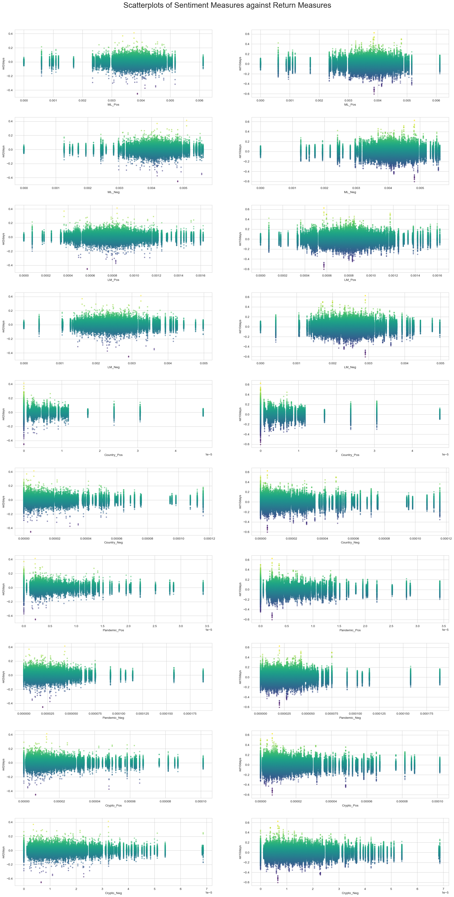

# William Rothpletz
## Assignment 5 Midterm Report


```python
# Required Imports for Analysis
import pandas as pd
import matplotlib.pyplot as plt
import seaborn as sns

# Load In Output File
data = pd.read_csv('output/analysis_sample.csv')
```

    C:\Users\wroth\AppData\Local\Temp\ipykernel_6820\3134901648.py:7: DtypeWarning: Columns (8) have mixed types. Specify dtype option on import or set low_memory=False.
      data = pd.read_csv('output/analysis_sample.csv')
    

# Abstract

This report is a cross-sectional event study that looks to answer the question of if positive or negative sentiment in a 10-K is associated with better or worse stock returns. Specifically, I am looking to see the tone of each 10-K filing by scanning the documents for words with positive or negative sentiment that I defined using the Machine Learning positive and negative sentiment datasets and the Loughran McDonald, or LM, Master Dictionary which can be found in the inputs file. In addition to this question, I also scanned through each 10-K to find out how often words under my three reserach topics, these being Countries facing conflict, the COVID pandemic, and crypto currencies, appeared next to positive and negative sentiment words and how this correlated to the firm's stock returns at the time. To answer these questions, I appended the sample dataset, sp500_2022.csv, by downloading the 10-K filings of each firm listed on the index in the file. I then coded a loop to open and clean the 10-K html file for each firm and measured both the overall sentiment as well as my contextual variables sentiment which I will discuss more below. I then appended these measures to the dataset, located each firm's cik and accession number to retrieve their filing date, and appened the filing date to the dataset. Finally, I merged this dataset with the daily returns for each firm, crsp_2022_only.zip, attempted to calculate the cumulative returns around the filing date, and saved my output as analysis_sample.csv. 

From my analysis, I found that there is little or no relationship between the overall document sentiment as well as my contextual sentiment variables and the 2 and 10 days returns around the firm's filing date. As seen in the report, there is a fairly even distribution among sentiment scores when plotted against 2 and 10 day returns. The primary thing that stood out to me from my contextual analysis was when countries in conflict were talked about with positive sentiment it had a significantly higher correlation to the returns around the filing date then when they were discussed with negative sentiment. In this report, I will provide more detail on my research as well as present my results to better explain my findings. 

# Description of the Data

### Sample Data

The sample data I used for this dataset is sp500_2022.csv. This file contains information on 503 companies currently listed on the S&P 500 index, and it includes each firm's ticker symbol, name, GIS sector and sub-industry, headquarters location, the date it was added to the index, and the year it was founded. This can be found in the inputs folder of this repository.

### Variables

#### Return Variables
To acquire my return variables, I loaded in my four sentiment dictionaries which were retrieved from the Machine Learning positive and negative sentiment datasets and the Loughran McDonald, or LM, Master Dictionary which are located in the inputs file. I loaded in the Machine Learning sentiment datasets using 
`BHR_pos = pd.read_csv('inputs/ML_positive_unigram.txt',header=None)[0].to_list()`
and then I formatted it to be able to be used with NEAR_Regex by using
`BHR_positive = ['('+'|'.join(BHR_pos)+')']`.

I then loaded in the Master Dictionary dataset using 
`LM_neg = pd.read_csv('inputs/LM_MasterDictionary_1993-2021.csv').query('Negative > 0')['Word'].to_list()`. This code is slightly different as the files is structured differently. To get the negative sentiment, I used the line `.query('Negative > 0')` and swapped "Negative" to "Positive" for the positive sentiment. I then formatted it to be able to be used with NEAR_Regex by using
`LM_negative = ['('+'|'.join(LM_neg)+')']`.

Next, after loading in my inputs file, sp500_2022.csv, I looped through the S&P 500 index and and loaded in each firm's 10-K html file. Then, by using the function BeautifulSoup, I cleaned the html files so they would be properlly formatted to be used with NEAR_Regex. Then, I utlized the NEAR_Regex function to calculate the ratio of positive and negative sentiment words to the overall length of the document in each 10-K by using
`ML_Pos = len(re.findall(NEAR_regex(BHR_positive), cleaned))/len(cleaned)`.

Finally, I appended these return variable to my existing data frame by using 
`sp500.loc[index, 'ML_Pos'] = ML_Pos`.

#### Contextual Sentiment Variables

To aquire my contextual sentiment variables, I utilized the same sentiment dictionaries from above. However, there are minor changes in the code to measure the ratio of positive and negative sentiment words to the overall length of the document. First, I had to define the words I would scanning for in my sentiment variable by using
`Country = ['(Ukraine|Taiwan|Russia|China|Turkey)']`. 

In this example, I am looking at my sentiment varaible for Countries facing Conflict.

Then, I concatenated my list with the sentiment dictionary using
`wordscp = [Country[0],LM_positive[0]]
wordscn = [Country[0],LM_negative[0]]`.

Next, I measured the ratio of how often my key words were found within 5 words positive and negative sentiment words to the overall length of the document by using
`Country_Pos = len(re.findall(NEAR_regex(wordscp,max_words_between=5), cleaned))/len(cleaned)
Country_Neg = len(re.findall(NEAR_regex(wordscn,max_words_between=5), cleaned))/len(cleaned)`.

Finally, I appended these sentiment variables to my existing data frame by using
`sp500.loc[index, 'Country_Pos'] = Country_Pos`.

#### My Topics

For my contextual sentiment topics, I chose to look at "Countries facing Conflict", "The COVID-19 Pandemic", and "Cryptocurrencies". I chose these three topics because I wanted to look at a range of topical issues that I believe could effect the returns of companies depending how they are discussed. I chose Countries facing Conflict because there are several countries constantly appearing in the news beacuse they are actively in conflict or they are facing domestic issues of conflict. I chose the COVID Pandemic because this was a recent global event that has lingering effect well into 2022 and I wanted to see how they may effect returns. Finally, I chose Cryptocurrencies because they are at the forefront of emergeing technologies and more and more companies are looking into using them or even investing in them. 

##### Smell Test

After analyzing my results, I beleive my contextual sentiment measures pass the basic smell test. There is nothing fishy upon my initial analysis and there is a lot of variation between topics and postivie and negative sentiments. Each variable is returning different values for each firm and each topic has instances where there is 0 mention of it, which is as expected. 

Futhermore, the industries I expect to be talking positively or negatively about my subject are. Specifically, Countries facing Conflict has a higher negative than positive return, and Cryptocurrencies has about an equal positive an negative return which is as I expected due to the uncertainty and opportunity in the field. The only industry result that suprised me was the Pandemic as it only has a marginally higher positive than negative return. I would have expected it to have a higher negative return, but this may be because we are nearly two years out from the pandemic and many times when it is now addressed it may be in the context of how the firm is improving the previous problems faced during the pandemic. 

#### Caveats

Unfortunately, there are a few caveats about my sample and data. First, not all 500 firms on the S&P index had their 10-K files loaded in as there was 503 registered on the input file but only 499 of them could have their 10-Ks properly retrieved. This does not heavily effect the analysis, but it is important to note that it is not a perfect analysis of all current firms in the S&P 500 index. 

Next, because of the nearly two hours it takes to run the for loops to measure sentiment in each 10-K, I kept my list of words in my contextual sentiment variables relatively short with only 5 words, and I had no variations of these words. In the future, I would add more words around each topic and include varations of each word like abbreviations and plural versions. This certainly may effect the analysis beacuse they was not enough words in each topic to properly measure how each 10-K is discussing the topic. 

Finally, the biggest caveat is that the cumulative returns is incorectly calculated as I could not find a way to properly calcualte the cumulative returns while skipping over weekends. Therefore, during my research I found code for rolling returns which would calculate the returns over a given period while skipping weekends which is what I was looking for. However, I recognize that this is an incorrect calculation as the returns are not cumulative and they are not based around the proper filing date that I retrieved earlier in my code. This was very frusterating as I wanted to have a proper analysis, and with more time and a longer report I would certainly make sure to have the proper cumulative returns. However, I wanted to still be able to analyze my data so I worked with the results I was able to obtain. This will cause a major issue with the analysis because I am not analyzing what my overall question in the report is as I do not have proper cumulative returns, and therefore my conclusions are likely not accurate. This report is still informative and can be used to inform the reader on how the sentiments of firm's 10-K reports, but it should be acknoledged that the calculation of returns is incorrect and must be adjusted to run a proper analysis.  

### Summary Statistics

The summary statistics of my variables is listed below, as well as directly below it is a correlation table measuring the amount of variation in the 2 and 10 day returns that can be explained by each sentiment analysis. Upon first glance, the summary stastics for my sentiment measures and variables look reasonable. The means and maxes all vary between topic and each topic has a minium score of 0 at least once because every 10-K will not be discussing all three of my contextual sentiment topics. 

There is one glaring issue in my summary statistics and that is the cumulative 2 and 10 day returns. They present minimum returns of about -45% and -60% respectively, and maximum returns of about 41% and 62% respectively. These are extrodinary returns over such a small time period, and I think this may have to do with how I improperly calculated my cumulative returns. Therefore, the results in these two columns are likely innacurate. 


```python
data.describe()
```


<div>
<style scoped>
    .dataframe tbody tr th:only-of-type {
        vertical-align: middle;
    }

    .dataframe tbody tr th {
        vertical-align: top;
    }

    .dataframe thead th {
        text-align: right;
    }
</style>
<table border="1" class="dataframe">
  <thead>
    <tr style="text-align: right;">
      <th></th>
      <th>Unnamed: 0</th>
      <th>CIK</th>
      <th>ML_Pos</th>
      <th>ML_Neg</th>
      <th>LM_Pos</th>
      <th>LM_Neg</th>
      <th>Country_Pos</th>
      <th>Country_Neg</th>
      <th>Pandemic_Pos</th>
      <th>Pandemic_Neg</th>
      <th>Crypto_Pos</th>
      <th>Crypto_Neg</th>
      <th>ret</th>
      <th>ret2days</th>
      <th>ret10days</th>
    </tr>
  </thead>
  <tbody>
    <tr>
      <th>count</th>
      <td>135438.000000</td>
      <td>1.354380e+05</td>
      <td>135126.000000</td>
      <td>135126.000000</td>
      <td>135126.000000</td>
      <td>135126.000000</td>
      <td>135126.000000</td>
      <td>1.351260e+05</td>
      <td>135126.000000</td>
      <td>135126.000000</td>
      <td>135126.000000</td>
      <td>135126.000000</td>
      <td>135432.000000</td>
      <td>135432.000000</td>
      <td>135432.000000</td>
    </tr>
    <tr>
      <th>mean</th>
      <td>67718.500000</td>
      <td>7.939646e+05</td>
      <td>0.003717</td>
      <td>0.004050</td>
      <td>0.000787</td>
      <td>0.002522</td>
      <td>0.000001</td>
      <td>1.322292e-05</td>
      <td>0.000003</td>
      <td>0.000023</td>
      <td>0.000014</td>
      <td>0.000014</td>
      <td>-0.000023</td>
      <td>-0.000023</td>
      <td>-0.000560</td>
    </tr>
    <tr>
      <th>std</th>
      <td>39097.727217</td>
      <td>5.518178e+05</td>
      <td>0.000637</td>
      <td>0.000607</td>
      <td>0.000222</td>
      <td>0.000615</td>
      <td>0.000004</td>
      <td>1.787321e-05</td>
      <td>0.000005</td>
      <td>0.000020</td>
      <td>0.000015</td>
      <td>0.000011</td>
      <td>0.023319</td>
      <td>0.033203</td>
      <td>0.070293</td>
    </tr>
    <tr>
      <th>min</th>
      <td>0.000000</td>
      <td>1.800000e+03</td>
      <td>0.000000</td>
      <td>0.000000</td>
      <td>0.000000</td>
      <td>0.000000</td>
      <td>0.000000</td>
      <td>0.000000e+00</td>
      <td>0.000000</td>
      <td>0.000000</td>
      <td>0.000000</td>
      <td>0.000000</td>
      <td>-0.456763</td>
      <td>-0.456550</td>
      <td>-0.605622</td>
    </tr>
    <tr>
      <th>25%</th>
      <td>33859.250000</td>
      <td>9.774500e+04</td>
      <td>0.003415</td>
      <td>0.003740</td>
      <td>0.000641</td>
      <td>0.002126</td>
      <td>0.000000</td>
      <td>5.306782e-07</td>
      <td>0.000000</td>
      <td>0.000010</td>
      <td>0.000004</td>
      <td>0.000005</td>
      <td>-0.012436</td>
      <td>-0.018352</td>
      <td>-0.042033</td>
    </tr>
    <tr>
      <th>50%</th>
      <td>67718.500000</td>
      <td>8.857250e+05</td>
      <td>0.003751</td>
      <td>0.004085</td>
      <td>0.000781</td>
      <td>0.002496</td>
      <td>0.000000</td>
      <td>6.459510e-06</td>
      <td>0.000000</td>
      <td>0.000019</td>
      <td>0.000010</td>
      <td>0.000011</td>
      <td>0.000000</td>
      <td>0.000540</td>
      <td>0.001823</td>
    </tr>
    <tr>
      <th>75%</th>
      <td>101577.750000</td>
      <td>1.138118e+06</td>
      <td>0.004067</td>
      <td>0.004409</td>
      <td>0.000898</td>
      <td>0.002864</td>
      <td>0.000000</td>
      <td>1.825928e-05</td>
      <td>0.000004</td>
      <td>0.000032</td>
      <td>0.000018</td>
      <td>0.000019</td>
      <td>0.012449</td>
      <td>0.018411</td>
      <td>0.042211</td>
    </tr>
    <tr>
      <th>max</th>
      <td>135437.000000</td>
      <td>1.932393e+06</td>
      <td>0.006124</td>
      <td>0.005621</td>
      <td>0.001623</td>
      <td>0.004981</td>
      <td>0.000047</td>
      <td>1.159137e-04</td>
      <td>0.000034</td>
      <td>0.000189</td>
      <td>0.000101</td>
      <td>0.000069</td>
      <td>0.398503</td>
      <td>0.413078</td>
      <td>0.625382</td>
    </tr>
  </tbody>
</table>
</div>


```python
# Correlation Table

# select variables
sentiment_cols = ['ML_Pos', 'ML_Neg', 'LM_Pos', 'LM_Neg', 'Country_Pos', 'Country_Neg', 'Pandemic_Pos', 'Pandemic_Neg', 'Crypto_Pos', 'Crypto_Neg']
return_cols = ['ret2days', 'ret10days']
selected_cols = sentiment_cols + return_cols
df = data[selected_cols]

# calculate correlations
corr_df = df.corr()[return_cols][:-len(return_cols)]

# output table
print(corr_df.to_string())
```

                  ret2days  ret10days
    ML_Pos       -0.002233  -0.005894
    ML_Neg       -0.003715  -0.009718
    LM_Pos       -0.001437  -0.001589
    LM_Neg       -0.003535  -0.009665
    Country_Pos   0.002373   0.006009
    Country_Neg  -0.000337  -0.001720
    Pandemic_Pos  0.002399   0.005197
    Pandemic_Neg  0.001970   0.004822
    Crypto_Pos   -0.000549  -0.001161
    Crypto_Neg    0.000484   0.000081
    

### Scatterplot Results


```python
# Scatterplots

# set plot style to whitegrid
sns.set_style("whitegrid")


# Define variables
variables = ['ML_Pos', 'ML_Neg', 'LM_Pos', 'LM_Neg', 'Country_Pos', 'Country_Neg', 'Pandemic_Pos', 'Pandemic_Neg', 'Crypto_Pos', 'Crypto_Neg']
returns = ['ret2days', 'ret10days']

# Create subplots
fig, axs = plt.subplots(nrows=len(variables), ncols=len(returns), figsize=(20, 40))

# Plot variables against each return
for i, variable in enumerate(variables):
    for j, ret in enumerate(returns):
        ax = axs[i][j]
        ax.scatter(df[variable], df[ret], s=10, alpha=0.5, c=df[ret], cmap='viridis') #Change coloring of data points 
        ax.set_xlabel(variable)
        ax.set_ylabel(ret)

# Add title
fig.suptitle('Scatterplots of Sentiment Measures against Return Measures', fontsize=24)

# Adjust spacing
plt.tight_layout()
plt.subplots_adjust(top=0.95, hspace=0.3, wspace=0.2)

# Print plot
plt.show()
```


    

    


### Discussion Questions

#### 1. Compare / contrast the relationship between the returns variable and the two “LM Sentiment” variables (positive and negative) with the relationship between the returns variable and the two “ML Sentiment” variables (positive and negative). Focus on the patterns of the signs of the relationships and the magnitudes. 

The "LM Sentiment" positive and negative variables have a very similar distributions for their respective return periods. LM positive and LM negative have similar distributions for the 2 day returns with the exception that the LM negatives returns appear to be slightly higher. When looking at LM positive and negative for the 10 day returns, once again the two figures have similar distributions. LM positive appears to have a wider range and slightly higher returns while LM negative has a more narrow range and slightly lower returns. 

Next, the "ML Sentiment" positive and negative variables once again have very similar distributions for their respective return periods. ML positive and ML negative for the 2 day returns have similar returns, but there was a far greater amount of negative sentiment uncovered than positive sentiment. When looking at ML positive and negative for the 10 day returns, the distributions reflect the 2 day returns and the positive and negative sentiment scores range farther apart. There is a significantly higher negative sentiment score than the positive one. 

Finally, when looking at similarities and differences between the returns variable of the sentiment variables, they seemed to report similar returns across the firms, but the ML datasets had significantly higher positive sentiments than the LM datasets. As seen on the x axis of the graphs, the ML datasets are centered around a .4% score while the LM datasets are centered around .08% and .25% which is significantly lower than the ML counterparts. Also, the LM positive measure returned significantly lower percentages of results than the other 3 pairs of graphs as the sentiment score had a max of about .16% while this is almost the lower bound for the other graphs. 

#### 2. If your comparison/contrast conflicts with Table 3 of the Garcia, Hu, and Rohrer paper (ML_JFE.pdf, in the repo), discuss and brainstorm possible reasons why you think the results may differ. If your patterns agree, discuss why you think they bothered to include so many more firms and years and additional controls in their study? (It was more work than we did on this midterm, so why do it to get to the same point?)

Unfortunately, my comparison/contrast did not coincide with Garcia, Hu, and Rohrer's paper. I strongly believe that this is beacuse my cumulative returns were improperly calculated. Not only did I use rolling returns used to calculate my cumulative returns, but I had difficulty formatting it around the filing date of each firm and I am not sure if it is even pulling the returns for each firm from the proper period. If I was able to properly calculate and load the cumulative returns, I expect that my outputs would match those in the paper.

However, even though I recognize that my outputs were incorectly calcuated, I still shared some of the findings they had like that my LM positive sentiment had a negatively correlated effect on returns. Unfortunately, my other sentiment measures were close to those reported by the paper but they often moved in the opposite direction from the 2 to 10 day returns. For example, their ML positive sentiment was negative for the short term returns and positive for the longer returns, but my calcualtions showed a stronger negative correlation in the short term returns and a weaker negative correlation for the longer returns. Once again, I think this is soley due to my improper calculation of the cumulative returns as I know that my sentiment variables were loaded and properly and correctly scanned through each 10-K.

#### 3. Discuss your 3 “contextual” sentiment measures. Do they have a relationship with returns that looks “different enough” from zero to investigate further? If so, make an economic argument for why sentiment in that context can be value relevant.


Two of my contextual sentiment measures have a relationship with returns that looks different enough from zero to investigate further, but one does not. 

First, my Crypto contextual sentiment provided a very small correlation of -.0005 for positive sentiment and .0004 for negative sentiments when compared to 2 day returns which are awfully close to 0 and give me little information on how the sentiment surrounding cryptocurrencies is effecting S&P 500 returns. These numbers also did not change much when looking at the 10 day returns. I think this could be due to my limited number of words that it was analyzing for the topic. I only had five words and no variations of these words, so there is certainly a chance that the topic was discussed more often and my code was just not able to pick up on it. This could also in part be due to my improper cumulative returns calcualtions. 

Second, my Pandemic contextual sentiment provided a small correlation of .0024 for positive sentiment and .002 for negative sentiment when compared to 2 day returns. These numbers are not as close to 0 and may indicate a slight correlation between the sentiment around discussing the pandemic and returns. The correlations when looking at the 10 day returns are even stronger with .0052 and .0048 reported respectively. In my opinion, sentiment when dicussing the pandemic can be value relevant because it examines how the company is responding in the post-pandemic period. If there is a lot of positive sentiment words surrounding the pandemic words, it likely suggests that the firm is reflecting on issues faced during the pandemic and improving their outlook for the future, while if there is a lot of negative sentiment words surrounding the pandemic words, it likely suggests that the firm is still suffering from lingering problems from the pandemic and is reporting these issues while citing the cause of them. Therefore, I think it certainly makes sense to investigate this relationship further. 


Third, my Country contextual sentiment provided a much higher correlation of .0024 and .006 for positive sentiment when compared to the 2 and 10 day returns respectively. On the other hand, there is a much weaker correlation of -.0003 and -.0017 for negative sentiment when compared to the 2 and 10 day returns respectively. These numbers are not as close to 0 and could indicate a correlation between sentiment used when discussing these countries facing conflict and a firm's returns. Also, these results intuitively make sense as when these countries are spoken about with positive sentiment there is a slight correlation to increasing returns while when they are spoken about with negative sentiment it may worry investors or shareholders and there is a slight correlation to reduing returns. Therefore, I think there is enough of a relationship present with returns to warrant further investigation. In my opinion, sentiment when dicussing countries that are facing conflict can be value relevant because if firms are discussing it in their 10-K, they are likely doing business in or with these countries and have to disclose what it going on. If there is a lot of positive sentiment words surrounding the country names, it likely suggests that the has a positive outlook on its operations in that country, while if there is a lot of negative sentiment words surrounding the country names, it likely suggests that the firm has been effected by these conflicts either directly because they have operations in the country or relationships with firms there, or indirectly through supply chain issues caused by the conflict. They may then be reporting why they faced issues and providing the reasoning by citing the foreign conflict. Therefore, I think it makes sense to investigate this relationship futher, and it also may be beneficial to include more varaitions of the country names, like their abbreviation, so that the findings are more accurate when scanning throught the 10-K reports. 


#### 4. Is there a difference in the sign and magnitude? Speculate on why or why not.

No, there is very little difference in the sign and magnitude of the ML positive and negative sentiment variabels correlation to the 2 and 10 day return measures. The ML positive and negative sentiment correaltions to 2 day returns are -.0022 and -.0037 respectively, and the ML positive and negative sentiment correaltions to 10 day returns are -.0058 and -.0097 respectively. These numbers do have the same sign as the numbers previously reported in Table 3 of the paper discussed above, but they have different magnitudes by about a factor of x10. 

While I think these results could indicate correaltions that may warrant futher investigation, I think the primary reason for the differnce in magnitude is due to my improper calcualtion of the cumulative returns. Unfortunately, I am not correctly measuring the correaltion between my sentiments and the returns of each of the firms, so the results may be and likely are reporting incorrect returns and therefore the two variables relationship is not properly being reflected. If I was to load the correct cumulative returns and rerun my analysis, I expect that my signs would reamin the same, but the magnitude of several of my varaibles would increase by anwhere between a factor of x10 to x100. 
